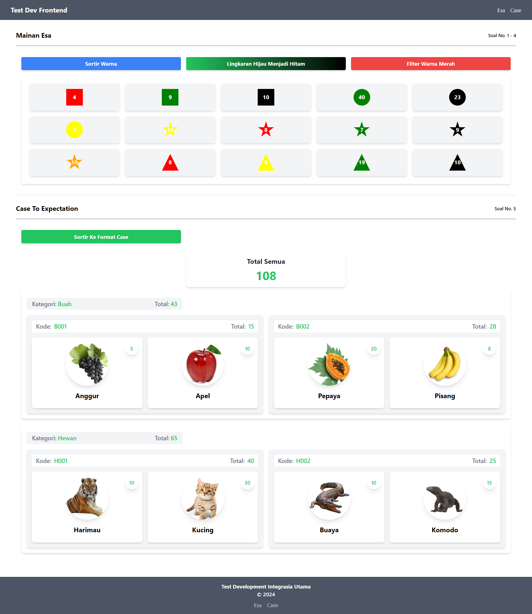
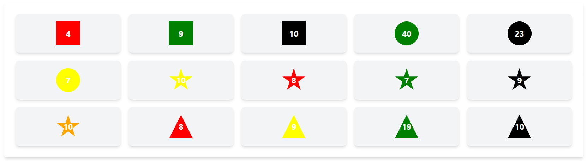
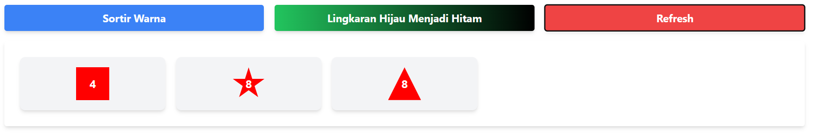
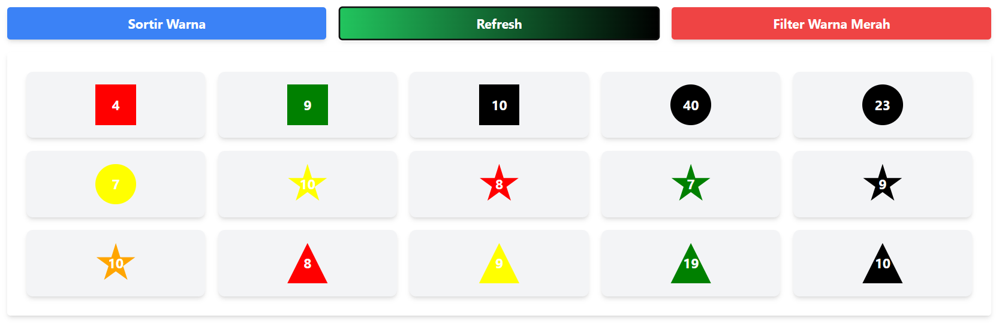
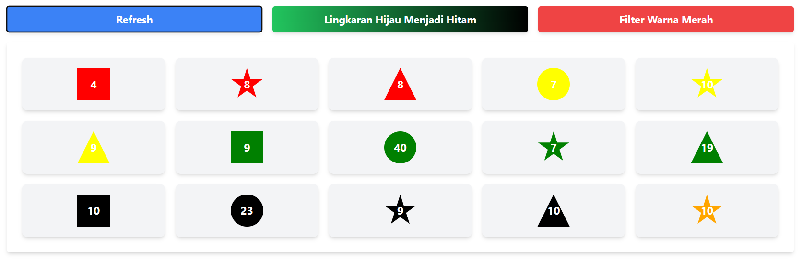
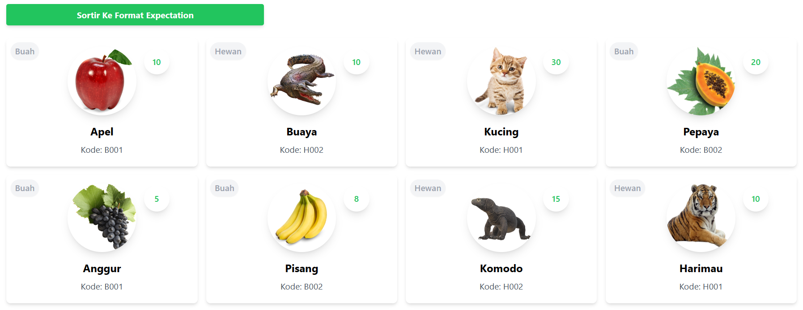
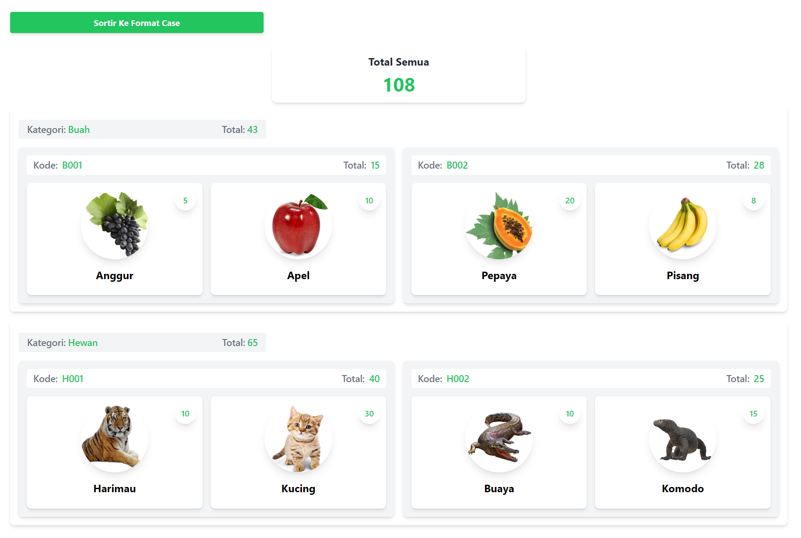

# Test Development Integrasia Utama

Test Dev Frontend By Eko Permana

## Hasil Test


## Detail Soal dan Jawaban
#### Soal 1 ####
    1. Buat data array dengan merepresentasikan sebegai berikut:
        Esa mempunyai mainan dengan macam-macam bentuk dan warna seperti berikut:
         - kotak = 4 merah; 9 hijau; 10 hitam
         - lingkaran = 40 hijau, 23 hitam, 7 kuning
         - bintang = 10 kuning, 8 merah, 7 hijau, 9 hitam, 10 jingga
         - segitiga = 8 merah, 9 kuning, 19 hijau, 10 hitam
#### Kode: ####
```json
{
    "data": [
        {
            "bentuk": "kotak",
            "warna": "merah",
            "jumlah": 4
        },
        {
            "bentuk": "kotak",
            "warna": "hijau",
            "jumlah": 9
        },
        {
            "bentuk": "kotak",
            "warna": "hitam",
            "jumlah": 10
        },
        {
            "bentuk": "lingkaran",
            "warna": "hijau",
            "jumlah": 40
        },
        {
            "bentuk": "lingkaran",
            "warna": "hitam",
            "jumlah": 23
        },
        {
            "bentuk": "lingkaran",
            "warna": "kuning",
            "jumlah": 7
        },
        {
            "bentuk": "bintang",
            "warna": "kuning",
            "jumlah": 10
        },
        {
            "bentuk": "bintang",
            "warna": "merah",
            "jumlah": 8
        },
        {
            "bentuk": "bintang",
            "warna": "hijau",
            "jumlah": 7
        },
        {
            "bentuk": "bintang",
            "warna": "hitam",
            "jumlah": 9
        },
        {
            "bentuk": "bintang",
            "warna": "jingga",
            "jumlah": 10
        },
        {
            "bentuk": "segitiga",
            "warna": "merah",
            "jumlah": 8
        },
        {
            "bentuk": "segitiga",
            "warna": "kuning",
            "jumlah": 9
        },
        {
            "bentuk": "segitiga",
            "warna": "hijau",
            "jumlah": 19
        },
        {
            "bentuk": "segitiga",
            "warna": "hitam",
            "jumlah": 10
        }
    ]
}
```
```js
// Manipulasi warna untuk kebutuhan UI
export const colorMapping = {
    'hitam': 'black',
    'merah': 'red',
    'hijau': 'green',
    'kuning': 'yellow',
    'jingga': 'orange'
};
```
#### Hasil: ####


#### Soal 2 ####
    2. Buat fungsi untuk mengambil mainan dari seluruh bentuknya yang warna merah
#### Kode: ####
```js
// Mengambil data mainan.json dengan filter warna merah
export const filterToyData = async () => {
    try {
        const response = await fetch(`${baseUrl}mainan.json`);
        const data = await response.json();

        // Manipulasi warna menggunakan colorMapping
        const manipulatedData = data['data'].map(item => ({
            ...item,
            warna: colorMapping[item.warna] || item.warna // Mengganti warna jika ada di colorMapping
        }));

        const redItems = manipulatedData.filter(item => item.warna === 'red');
        return redItems;
    } catch (error) {
        console.error('Gagal memfilter data:', error);
        return null;
    }
};
```
```js
// Tindakan untuk memfilter item warna merah
const getRedItems = async () => {
    if (!buttonClicked.getRed) {
        try {
            const data = await filterToyData(); // Memanggil api yang memfilter mainan warna merah
            setToyData([...data]); // Mendeklarasikan semua array
            setButtonText({ ...buttonText, getRed: 'Refresh' });
            setButtonClicked({ ...buttonClicked, getRed: true });
        } catch (error) {
            console.error('Gagal mengambil data merah:', error);
        }
    } else {
        setToyData(originalToyData);
        setButtonText({ ...buttonText, getRed: 'Filter Warna Merah' });
        setButtonClicked({ ...buttonClicked, getRed: false });
    }
};
```
#### Hasil: ####


#### Soal 3 ####
    3. Buat fungsi untuk mengganti mainan lingkaran yang berwarna hijau menjadi warna hitam
#### Kode: ####
```js
// Mengambil data mainan.json
export const fetchToyData = async () => {
    try {
        const response = await fetch(`${baseUrl}mainan.json`);
        const data = await response.json();

        // Manipulasi warna menggunakan colorMapping
        const manipulatedData = data['data'].map(item => ({
            ...item,
            warna: colorMapping[item.warna] || item.warna // Mengganti warna jika ada di colorMapping
        }));

        return manipulatedData;
    } catch (error) {
        console.error('Gagal menampilkan data:', error);
        return null;
    }
};
```
```js
// Tindakan untuk mengubah item lingkaran hijau ke hitam
const changeGreenToBlack = () => {
    if (!buttonClicked.changeColor) {
        const updatedData = toyData.map(item => {
            if (item.bentuk === 'lingkaran' && item.warna === 'green') {
                return { ...item, warna: 'black' };
            }
            return item;
        });
        setToyData(updatedData);
        setButtonText({ ...buttonText, changeColor: 'Refresh' });
        setButtonClicked({ ...buttonClicked, changeColor: true });
    } else {
        setToyData(originalToyData);
        setButtonText({ ...buttonText, changeColor: 'Lingkaran Hijau Menjadi Hitam' });
        setButtonClicked({ ...buttonClicked, changeColor: false });
    }
};
```
#### Hasil: ####


#### Soal 4 ####
    4. Buat fungsi yang mengurutkan berdasarkan warna merah, kuning, hijau, hitam, jingga
#### Kode: ####
```js
// Urutan warna untuk sortir warna
export const colorOrder = {
    'red': 1,
    'yellow': 2,
    'green': 3,
    'black': 4,
    'orange': 5
};
```
```js
// Tindakan untuk sortir item mainan melalui warna
const sortMainanByColor = () => {
    if (!buttonClicked.sort) {
        const sortedData = [...toyData].sort((a, b) => {
            return colorOrder[a.warna] - colorOrder[b.warna];
        });
        setToyData(sortedData);
        setButtonText({ ...buttonText, sort: 'Refresh' });
        setButtonClicked({ ...buttonClicked, sort: true });
    } else {
        setToyData(originalToyData);
        setButtonText({ ...buttonText, sort: 'Sortir Warna' });
        setButtonClicked({ ...buttonClicked, sort: false });
    }
};
```
#### Hasil: ####


#### Soal 5 ####
    5. Buatkan fungsi yang memformat json (assets/json/case.json) menjadi seperti (assets/json/expectation.json)
#### Kode: ####
```js
// Mengambil data case.json
export const fetchCaseData = async () => {
    try {
        const response = await fetch(`${baseUrl}case.json`);
        const data = await response.json();
        return data['data'];
    } catch (error) {
        console.error('Gagal menampilkan data:', error);
        return null;
    }
};
```
```js
// Mengelompokkan kategori buah dan hewan agar buah lebih dulu ditampilkan
export const filterData = (caseData) => {
    const filtered = {
        total: 0,
        data: []
    };

    // Objek untuk menyimpan total per code
    const totalsByCode = {};

    // Filter data untuk Buah dan Hewan
    const categories = ['Buah', 'Hewan'];
    categories.forEach(category => {
        const categoryData = {
            category: category,
            total: 0,
            data: {}
        };

        const filteredItems = caseData.filter(item => item.category === category);
        filteredItems.forEach(item => {
            const { code, name, total } = item;

            // Inisialisasi total untuk kode jika belum ada
            if (!totalsByCode[code]) {
                totalsByCode[code] = 0;
            }

            // Akumulasi total untuk kode
            totalsByCode[code] += total;

            // Mengumpulkan data untuk kode
            if (!categoryData.data[code]) {
                categoryData.data[code] = {
                    total: 0,
                    data: []
                };
            }
            categoryData.data[code].total += total;
            categoryData.data[code].data.push({ name, total });

            // Akumulasi total kategori
            categoryData.total += total;
        });

        filtered.total += categoryData.total;
        filtered.data.push(categoryData);
    });

    // Tambahkan total per code ke dalam data kategori
    filtered.data.forEach(categoryData => {
        Object.keys(categoryData.data).forEach(code => {
            categoryData.data[code].total = totalsByCode[code];
        });
    });

    return filtered;
};
```
#### Hasil: ####


